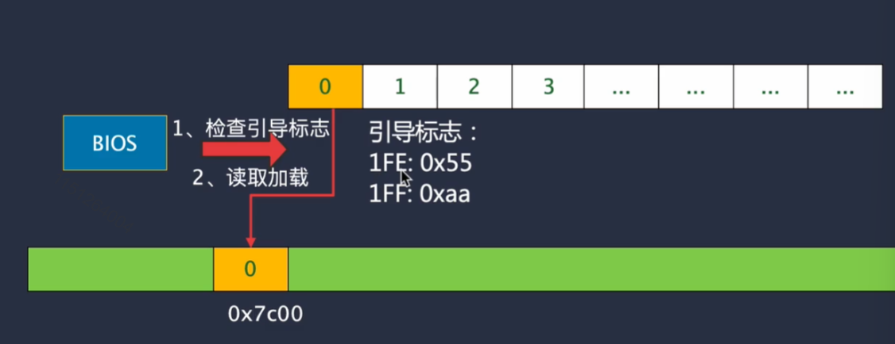
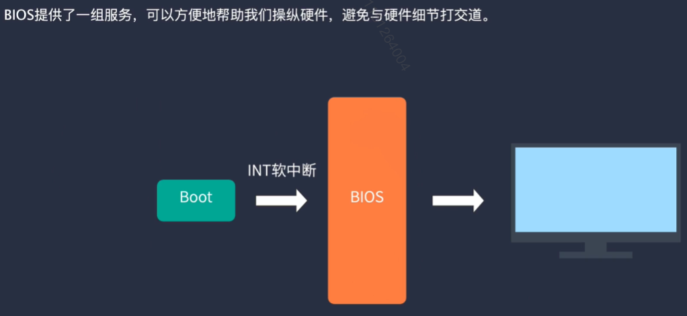
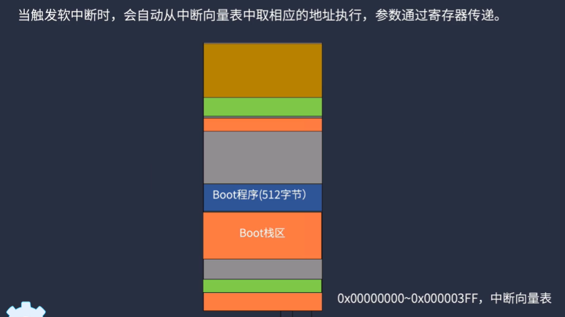

## BIOS & Loader

### 引导程序：接管控制权

启动时，BIOS会将磁盘的第0个扇区加载到0x7c00处开始运行。即只要将程序放在第0扇区，就会自动被加载到内存中。

启动时，检查第0扇区最后两个字节是否 == 0x55, 0xAA

让栈寄存器esp指向0x7c00，由于入栈是高地址往低地址，所以使用的是0x7c00下的地址。

> 实模式只支持访问1MB以内的内存，具体的内存映射如下：
>
> 
>
> 
>
> 

#### 使用 BIOS 中断显示字符

通过软中断INT指令，访问内存中中断向量表的地址处执行相应功能。

**INT 10，AH=0xE显示字符**

该BIOS中断的作用是：显示字符，同时光标前移，其中AL = 字符、BL = 前景色，BH＝页码。

具体来说，BH 为目前的显示页，如果是在图形模式，则 BH 须设为 0，假如是在图形模式下，也可以设定 BL 来表示文字的颜色，文字模式下的 BL 则无功能。至于显示页是什么，不需要了解，只需要将它设置成零即可。

#### loader 编写

BIOS 只加载磁盘的第0扇区（512字节）到内存中，因此这512字节的程序做不了太多事情。因此需要loader来完成剩下的引导。

loader放在了0x8000，这是我的设计，放在0x7c00的栈空间前也可以的。

boot启动之后，将调用BIOS中断从第1扇区加载loader到0x8000地址处，之后跳转到0x8000地址处运行。

**INT 13 磁盘读取**

BIOS提供了磁盘操作的服务中断，其具体使用方法如下：

> - AH＝02H
> - AL＝扇区数
> - CH＝柱面 cx = ch: cl
> - CL＝扇区
> - DH＝磁头
> - DL＝驱动器，00H~7FH：软盘；80H~0FFH：硬盘
> - ES:BX＝缓冲区的地址
> - 出口参数：CF＝0——操作成功，AH＝00H，AL＝传输的扇区数，否则，AH＝状态代码，参见功能号01H中的说明。CF标志见EFLAS寄存器中的CF位。

功能：在内存中划定一段区域(AL)，从磁盘中读取指定扇区的内容(CH)，加载到ES:BX内存处(这里是0x8000)。

#### loader 跳转

boot和loader分属两个工程，共生成两个bin文件。

从boot跳到loader，只知道loader的起始地址为0x8000，所以采用函数指针转换。`((void (*)(void))LOADER_START_ADDR)()` 即认为在0x8000地址处存放了这种类型的函数的代码，通过调用函数函数进入到loader中运行。

注：无论是boot还是loader，其工程均已经配置好让`start.S`中的代码位于生成的bin文件开头。所以无论是boot还是loader，其最开头的指令总是程序的入口指令。
