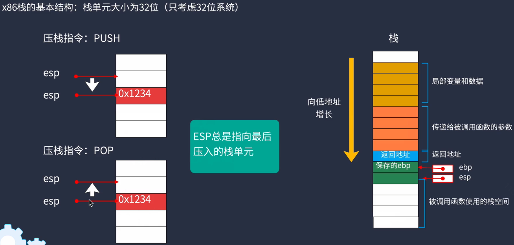
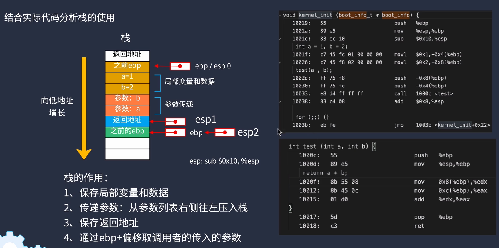
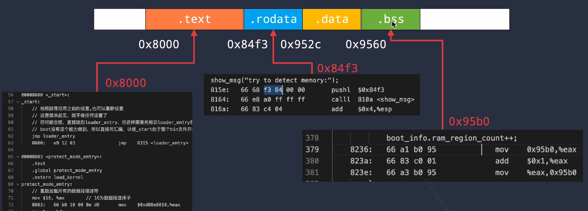

### loader 实现

#### 1. 内存检测

编写一个函数`void detect_memory()`，借助BIOS中断实现以下内容：

> **第一次调用时，ES: DI存储保存读取的信息的存储位置**
>
> - 清除EBX，设置为0
> - EDX需要设置成：0x534D4150
> - EAX设置成：0xE820
> - ECX设置成：24
> - 执行INT 0x15
> - 返回结果：EAX = 0x534D4150，CF标志清0，EBX被设置成某个数值用于下次调用，CL=实际读取的字节数
>
> **后续调用：**
>
> - EDX需要设置成：0x534D4150
> - EAX重设为0xE820
> - ECX重设为24
> - 执行INT 0x15
> - 返回结果：EAX = 0x534D4150，CF标志清0。如果EBX=0，则表明读取完毕，否则当前条目有效。

将可用的内存信息，储存至结构体`boot_info`中。


可见有两块可用的内存区域，从 0~654336，1048576~133038080 (即0~640KiB左右，1MiB~128MiB不到的位置)

#### 2. 进入保护模式

CPU上电复位后进入实模式，此模式下没有任何保护机制，但提供了BIOS服务。

**保护模式特性：**

1. 只能访问1MiB内存，寄存器最大为16位宽
2. 所有操作数最大为16位
3. 没有任何保护机制
4. 没有特权级
5. 没有分页和虚拟内存

**实模式特性:**

1. 最大可访问内存为4GiB，寄存器位宽为32位
2. 操作数最大为32位，出入栈也为32位
3. 4种特权级，OS最高，应用程序最低
4. 支持分页和虚拟内存


**流程1**: `cli()`关中断

**流程2:** 开启A20地址线，`uint8_t v = inb(0x92)`, `outb(0x92, v | 0x02)`, `lgdt((uint32_t)gdt_table, sizeof(gdt_table))`;

**流程3: **加载gdt表，lgdt

**流程4: **开启保护模式使能位cr0

**流程5: **远跳转；编写汇编代码，取消原16位的指令


#### 3. 使用LBA48模式读取磁盘

在保护模式下BIOS功能无法使用，读取磁盘要使用LBA模式。

由于读取的磁盘数据会放在1MB以上的内存区域，所以也不便于在进入保护模式前使用BIOS的磁盘读取服务来读取。

LBA48模式将硬盘上所有的扇区看成线性排列，没有磁盘、柱面等概念，因此访问起来更加简单，扇区序号从0开始。


#### 4. 内核工程

内核代码被写入磁盘的第100号扇区，加载到内存的1MiB地址处。


这一步做的事是：

1.在bat文件里，

```bash
dd if=kernel.elf of=%DISK1_NAME% bs=512 conv=notrunc seek=100
```

将kernel.elf 写进磁盘的第100个扇区；


2.在CMakeList里，将kernel工程下的输出目标设定为 > kernel.elf

```cmake
add_custom_command(TARGET ${PROJECT_NAME}
                   POST_BUILD
                   COMMAND ${OBJCOPY_TOOL} -O binary ${PROJECT_NAME}.elf ${CMAKE_SOURCE_DIR}/../../image/${PROJECT_NAME}.elf
                   
                   ...
                   
                   )
```


3.看函数: `read_disk(100, 500, (uint8_t*)SYS_KERNEL_LOAD_ADDR)`

从第100个扇区开始，往后读500个扇区的内容（也就是250KiB）。因为内核放在第100个扇区（前面是loader），所以是100，也可以说明内核代码不会超过250KiB。


#### 5. 向内核传递启动信息

将内核的入口地址处视为存放着一个接收启动信息参数的函数，使用函数调用


需要了解一些函数调用时参数传递的知识







即 在 init/start.S里开头写的就是`void start(boot_info_t*)` 

init/start.S里需要写的汇编内容就是按照函数调用规范，取boot_info_t*的参数值。


#### 6. 代码数据段与链接脚本

编译器将整个工程的代码和数据按照四个段存放。



.text 代码段

.rodata 只读数据，存放常量和字符串本身

> 一般存放 `const type`，如`const int`、`const char*`

.data 存放初始化有非0值的数据，全局的或静态的

> 存放已初始化（有非0初值）的（无论有无`static`的）全局变量 和 已初始化（有非0初值）的`static`局部变量

.bss 存放未初始化的数据（即为0），全局的或静态的

stack 局部变量

**相同类型的段会自动进行合并**

```
SECTIONS {
    . = 0x100000;
    .text : {
        *(.text) 
    }

    .rodata : {
        *(.rodata)
    }

    .data : {
        *(.data)
    }

    .bss : {
        *(.bss)
    }
}
```


#### 7. 加载内核映像文件

**主要涉及到 ELF 文件的读取**。如果直接用链接器文本，以上面的脚本段方式来写程序的内存布局，则可能存在的问题是：

以上面的程序为例，如果把 .data 段的起始位置设置的很大，如：

```
SECTIONS {
    . = 0x100000;
    .text : {
        *(.text) 
    }

    .rodata : {
        *(.rodata)
    }

	. = 0x80000000
    .data : {
        *(.data)
    }

    .bss : {
        *(.bss)
    }
}
```

这样的生成方式会让最终生成的文件内存连续分布，即 .rodata 段和 .data 段中间的内容即使是全为0，但也会占内存。最终文件大小应该会在2G+以上。

所以要使用ELF文件来实现分段加载程序的功能。

ELF文件以代码加载的视角来看，分布如下：


1. ELF header包含了该文件的全局性配置数据：


2. Program header table 的位置由字段 `Elf32_Off e_phoff` 指定， 该位置存储了以下结构体表项，表项数量由 `Elf32_Half e_phnum` 指定

   

该结构体描述了需要加载到内存中的相关配置信息，可以根据其中的配置，进行解析加载。根据以下分析，具体的加载过程如下：

- 初步检查elf header的合法性
- 通过elf header->e_phoff定位到programe header table，遍历elf header->e_phnum次，加载各个段

- - 从文件位置p_offset处读取filesz大小的数据，写入到内存中paddr的位置处
  - 如果p_filesz < p_memsz，则将部分内存清零（bss区初始化）

- 取elf header->e_entry，跳转到该地址运行。

从上述流程可以看出，在C代码中定义的未初始化的全局变量（分配在BSS区，初始值为0），并没有在ELF中分配相应的空间，需要自己在内存中手动清0.


**然后的设计是，把kernel.elf的内容加载到内存的0x100000（1MiB）处，然后解析elf，把kernel.elf的实际代码和数据存放在0x10000（64KiB）处**


#### ====== 阶段总结 ======

这一部分的工作流程是：

1. 刚刚从BIOS进入到了loader代码，一开始的代码是loader_16.c，做了两个工作：

   1. 内存检测，得到的结果信息储存在结构体`boot_info`中
   2. 开启保护模式

2. 进入保护模式，需要：关闭中断、开启A20地址线、加载gdt表、cr0寄存器使能、远跳转至32位的代码loader_32.c。**需要注意，开启保护模式后BIOS中断将无法使用**

3. loader_32.c的工作就是加载内核。首先执行的函数是`load_kernel(void)`，使用LBA48模式读取磁盘，把磁盘中的内核代码`kernel.elf`（在第100个扇区）写入内存中的 0x100000 (1MiB) 处。

4. 然后执行 `reload_elf_file(1024 * 1024)`函数，意思是解析0x100000处存放的elf内容。该函数将elf文件解析，放置在内存0x10000处，也就是64KiB处。

5. 这样内核就加载完了。

   此时，需要把内存检测的信息让内核代码使用。

   这里使用的做法是函数调用传参数，将内核的入口地址处视为存放着一个接收启动信息参数的函数。调用这个函数的时候即意味着跳转到这个地址，并取出了`boot_info`参数，可以使用。代码如此：`((void (*)(boot_info_t*))0x10000)(&boot_info)`。

   这就表示直接跳到 0x10000 处运行，也就是刚刚解析elf文件加载的内容