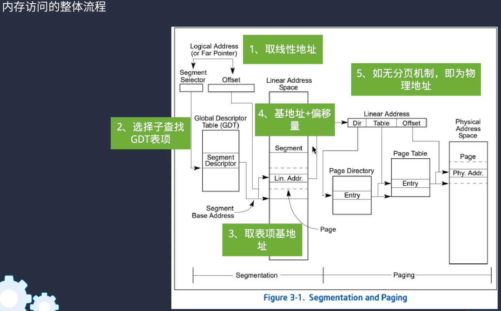

### 中断与异常处理

#### 1. 创建GDT表及其表项

进入保护模式后，所有访问内存的操作必须经过GDT表。GDT表中每项成为段描述符（Segment descriptors）。

进入内核后，首先初始化GDT表，将所有表项置为0。

#### 2. 保护模式下内存管理（概念）

 

#### 3. 重新加载 GDT

采用平坦模型：

**这里的平坦模型内存设计，GDT表就类似于RISC-V中的内核页表，需要设置GDT表的attr值的各bit位。如下：**

