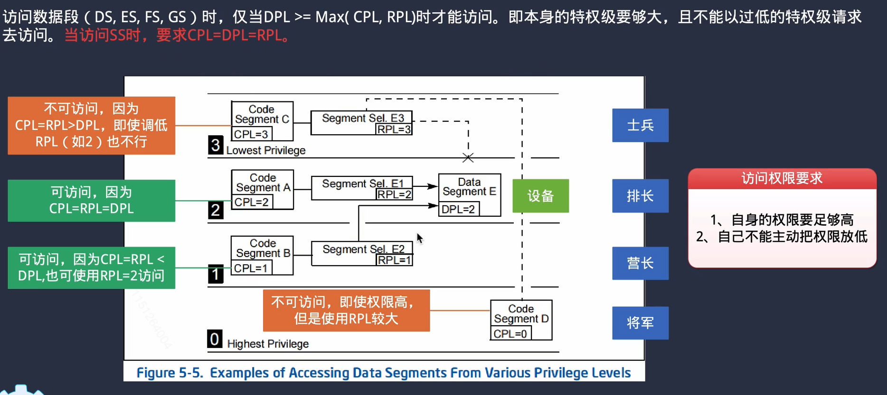
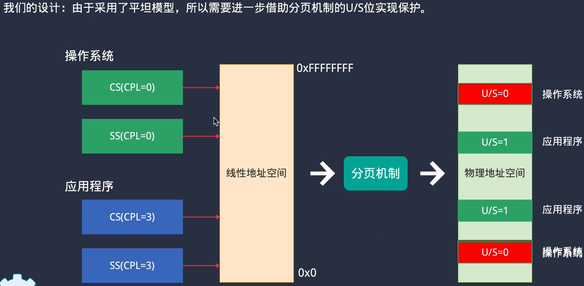

### 8 process

#### 1 进程搬运独立

因为目前没有文件系统，只能从内存中的进程来做实验

每个进程都需要设置寄存器。

项目里，采用的方式是，先把内核里自己编写的进程，代码搬到0x80000000+处，模拟一下用户进程。

具体做法是，在链接器脚本里，写好了，将 firsk_task_entry 的位置加载到物理地址的1MiB内，但是虚拟地址加载到了0x80000000+，也就是说，在调用函数read_elf时，将程序装载到内存时还是放在1MiB内的，但是这个程序的指令，全都是在0x80000000上操作的。

#### 2 特权级

x86关于权限控制的bit位好像比较复杂，CPL、DPL、RPL等，没怎么管。项目里采用的方法是操作系统的代码都是CPL = 0, 应用程序的 CPL = 3。

本项目设计：操作系统的特权级全为0，应用程序的特权级全为3。内存保护用分页机制的页表控制来做

**小总结：**CPU在执行代码时，要考虑3处的特权级：

- CS寄存器，其中有几个比特位存放了特权级标志CPL

- 段选择子，有几个bit位存放了特权级标志RPL （也就是说选择子作为下标去取GDT表项元素时，它的前3位是有其他作用的，这也解释了为什么选择子作为索引时偏移为8）

  

- GDT表项，有几个bit位存放了特权级标志DPL

  

项目在这里时，进程切换到idle进程时，OS会直接挂掉，这是因为，idle在init_task -> init_tss 时，给它设置成了特权级3。但是存放idle代码的页表，它的特权级是0。