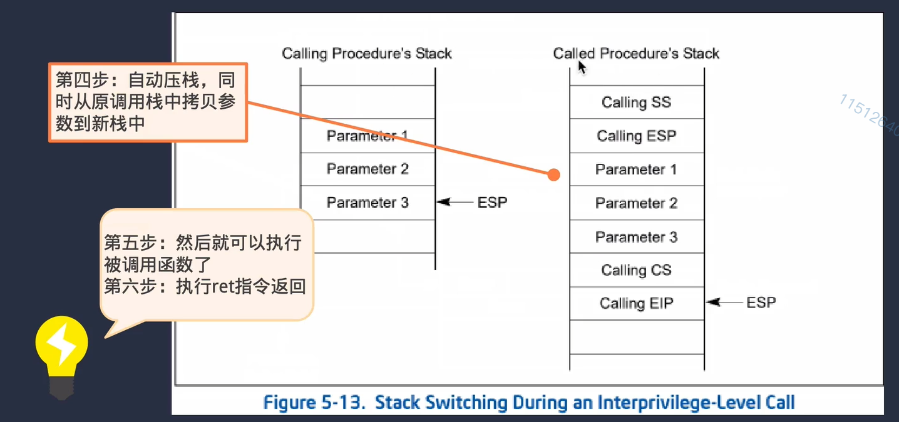
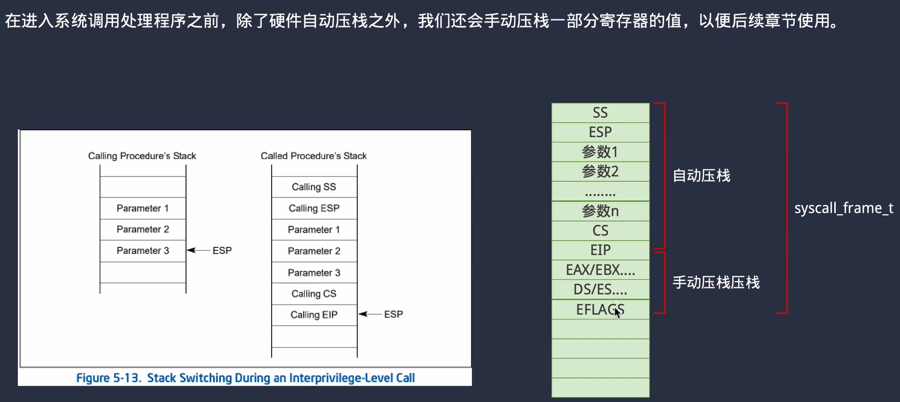

### 9 syscall

#### 1 syscall Gate 和 参数传递

`lcalll`即为syscall调用，和中断类似，会存放SS,ESP,CS,EIP等寄存器（没有EFLAGS），而且会把用户栈的参数拷贝到内核栈里（EFLAGS）的位置。

需要在GDT表里建立一个表项，表项格式与GATE门一致。表项如下：

`#define SELECTOR_SYSCALL (3 * 8)`

DPL的权限要为3，因为要保证用户态程序也能访问；

offset设置为`exception_handler_syscall`的入口地址

Segment Selector设置为`KERNEL_SELECTOR_CS`

返回时使用 `retf num`，该指令先将EIP、CS返回，然后向上跳转num个字节，然后在返回ESP、SS

#### 2 过程设计

1. 自己多加了一些寄存器，为了以后的工作可能会需要这些寄存器

2. 只使用一个调用门，然后通过这个调用门，去跳转到C函数里，分发syscall

#### ====== 自我总结 ======

要写一下调用的流程
